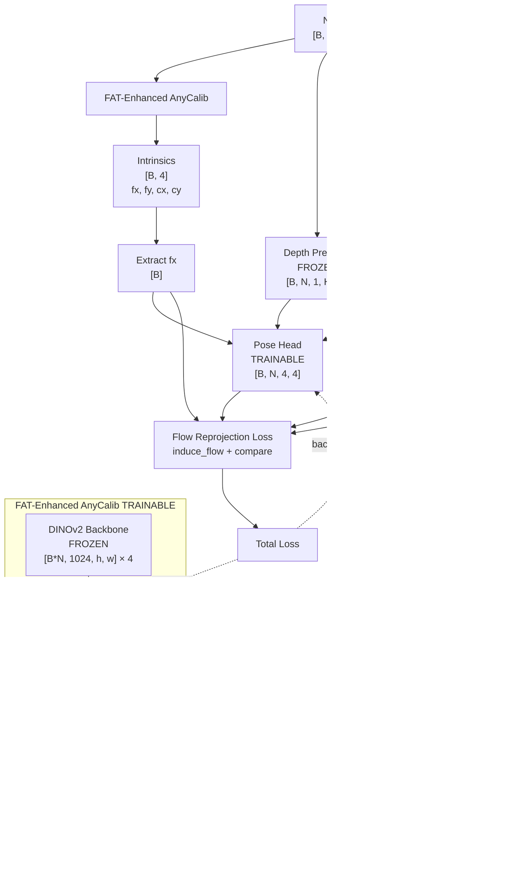

# FAT Phase 3: End-to-End Training Implementation

## Overview

Implement Phase 3 training that integrates FAT-enhanced AnyCalib into the full AnyCam pipeline with flow reprojection loss, supporting multi-frame sequences and per-epoch benchmarking.

## Architecture

### Pipeline Flow (Phase 3)



### Gradient Flow

**Trainable Path**: Loss → Pose Head (updated) → FAT (updated via focal length dependency)

**Frozen Components**: DINOv2, DPT, Ray Head, Depth Predictor, Flow Processor

---

## Implementation Tasks

### 1. Create AnyCamWrapperWithFATCalibration

**File**: [`experiments/models/anycam_wrapper_fat.py`](experiments/models/anycam_wrapper_fat.py) (new file)

**Based on**: `AnyCamWrapperWithDA3Calibration` from [`experiments/train_pose_head_anycalib.py`](experiments/train_pose_head_anycalib.py)

**Key components**:

- Use `AnyCaLibWithFAT` (from [`experiments/models/anycalib_with_fat.py`](experiments/models/anycalib_with_fat.py)) for calibration
- Integrate depth predictor, flow processor, pose predictor (reuse from DA3)
- Support multi-frame sequences (not just pairs)
- Extract focal length (fx) from FAT's predicted intrinsics

**Methods to implement**:

```python
class AnyCamWrapperWithFATCalibration(nn.Module):
    def __init__(self, fat_model, pose_predictor_config, depth_predictor_config)
    def freeze_except_fat_and_pose(self)  # Freeze everything except FAT + pose head
    def forward(self, images)  # Full pipeline: images → intrinsics → depth → flow → pose
```

### 2. Implement Phase 3 Training Function

**File**: [`experiments/train_fat_calibration.py`](experiments/train_fat_calibration.py)

**Replace** the placeholder `train_phase_3()` function (lines 1509-1536) with full implementation.

**Key features**:

- Load Phase 2 checkpoint for FAT
- Initialize AnyCamWrapperWithFATCalibration
- Use flow reprojection loss (from `anycam.loss.make_loss`)
- Support alternating training (FAT epoch, Pose epoch, FAT epoch, ...)
- Per-epoch benchmarking (both calibration and pose)
- Multi-frame sequences with step=2 (half the data)

**Training loop structure** (similar to DA3 Stage 3):

```python
for epoch in range(num_epochs):
    # Optionally alternate: freeze pose OR freeze FAT
    for batch in dataloader:
        images = batch['imgs']  # [B, N, 3, H, W]
        
        # Forward through full pipeline
        pose_result = model(images)
        
        # Compute flow reprojection loss
        loss, loss_dict = criterion.compute_pose_loss(pose_result)
        
        # Backward
        loss.backward()
        optimizer.step()
    
    # Validation
    if val_dataloader:
        val_loss = validate_epoch()
    
    # Per-epoch benchmarking (both calibration + pose)
    if benchmark_iterator:
        calibration_metrics = benchmark_calibration_accuracy(...)
        pose_metrics = benchmark_pose_accuracy(...)
```

### 3. Create Benchmark Infrastructure

**Files to create/modify**:

- Add `PoseBenchmarkIterator` to [`experiments/train_fat_calibration.py`](experiments/train_fat_calibration.py) (reuse from DA3)
- Add `benchmark_pose_accuracy()` function (adapted from DA3 Stage 3)
- Extend existing `CalibrationBenchmarkIterator` for calibration benchmarking

**Benchmarking setup**:

- Create test dataset with GT poses and intrinsics (require_gt=True)
- Every epoch: evaluate on fixed 50-100 test samples
- Compare FAT model vs AnyCam baseline (32 candidates)
- Log both calibration errors and pose errors
- Plot separate benchmark curves

### 4. Dataset Configuration

**File**: [`experiments/train_fat_calibration.py`](experiments/train_fat_calibration.py)

**Modify** `ObjectronFATDataset` to support:

- Multi-frame sequences for Phase 3 (N = max_ahead + 1 frames)
- Frame sampling with step=2 (use half the data)
- Load GT poses for benchmarking
- Compatible with AnyCam pipeline (needs depths, flows)

**Note**: May need to create `ObjectronFATDatasetPhase3` that extends existing dataset to provide flow/depth compatible format.

### 5. Update Documentation

#### 5.1 README.md

**File**: [`experiments/fat_integration/README.md`](experiments/fat_integration/README.md)

**Add sections**:

**Phase 3 Training Command**:

```bash
python experiments/train_fat_calibration.py --phase 3 \
    --phase2_checkpoint experiments/fat_integration/phase2_training_v2/checkpoints/latest_checkpoint.pt \
    --objectron_videos /data/thesis/Objectron/videos \
    --objectron_gt /data/thesis/Objectron/processed_gt \
    --max_ahead 3 \
    --num_epochs 50 \
    --batch_size 2 \
    --learning_rate 1e-5 \
    --enable_alternating_training \
    --benchmark_calibration_samples 50 \
    --benchmark_pose_samples 50 \
    --save_dir experiments/fat_integration/phase3_training
```

**Phase 3 Architecture Details**:

- Full pipeline description
- Trainable vs frozen components
- Loss function (flow reprojection)
- Alternating training strategy
- Benchmarking setup

**Phase 3 vs Phase 1/2 Table**:

| Setting | Phase 1/2 | Phase 3 |

|---------|-----------|---------|

| Loss | Reprojection loss (V3) | Flow reprojection loss (AnyCam) |

| Trainable | FAT only | FAT + Pose Head |

| Pipeline | AnyCalib only | Full AnyCam (depth, flow, pose) |

| Benchmarking | None | Calibration + Pose (per epoch) |

| Data | Multi-frame (calibration) | Multi-frame (pose estimation) |

#### 5.2 ARCHITECTURE_DETAILED.md

**File**: [`experiments/fat_integration/ARCHITECTURE_DETAILED.md`](experiments/fat_integration/ARCHITECTURE_DETAILED.md)

**Add new section**: "Phase 3: End-to-End Training"

**Include**:

1. **Architecture diagram** with dimensions
2. **Forward pass** (step-by-step with tensor shapes)
3. **Backward pass** (gradient flow explanation)
4. **Comparison with DA3 Stage 3**
5. **Alternating training explanation**
6. **Benchmarking methodology**

**Forward Pass Example**:

```
Input: [B=2, N=4, 3, 480, 640]
  ↓
FAT-Enhanced AnyCalib:
  DINOv2: [8, 3, 490, 644] → [8, 1024, 35, 46] × 4
  FAT: [8, 1024, 35, 46] → [2, 1024, 35, 46] × 4
  DPT+Ray: [2, 1024, 35, 46] → [2, 3, 480, 640]
  Calibrator: [2, 3, 480, 640] → [2, 4]
  Extract fx: [2, 4] → [2]
  ↓
Depth Predictor: [2, 4, 3, 480, 640] → [2, 4, 1, 480, 640]
  ↓
Flow Processor: [2, 4, 3, 480, 640] → [2, 4, 3, 480, 640]
  ↓
Pose Head: 
  Input: depths, flows, focal_length
  Output: poses [2, 4, 4, 4], uncert [2, 4, ?, 480, 640]
  ↓
Flow Reprojection:
  induce_flow(depths, poses, focal_length) → induced_flow [2, 4, 2, 480, 640]
  compare(induced_flow, observed_flow) → loss (scalar)
```

### 6. Add Command Line Arguments

**File**: [`experiments/train_fat_calibration.py`](experiments/train_fat_calibration.py)

**Add to `parse_args()`**:

```python
parser.add_argument('--enable_alternating_training', action='store_true',
                    help='Alternate between training FAT and Pose Head')
parser.add_argument('--benchmark_pose_samples', type=int, default=50,
                    help='Number of samples for pose benchmarking per epoch')
parser.add_argument('--phase2_checkpoint', type=str,
                    help='Phase 2 checkpoint to load for Phase 3')
```

### 7. Loss Function Integration

**File**: [`experiments/train_fat_calibration.py`](experiments/train_fat_calibration.py)

**Import and use AnyCam's loss**:

```python
from anycam.loss import make_loss

# In train_phase_3():
loss_config = {
    'flow_criterion': 'l1',
    'dist_criterion': 'l1',
    'lambda_flow': 1.0,
    'lambda_dist': 1.0,
    'use_flow_uncertainty': True,
}
criterion = make_loss(loss_config)

# Training loop:
loss, loss_dict = criterion.compute_pose_loss(pose_result)
```

---

## Key Implementation Details

### Multi-Frame Handling

Unlike DA3 Stage 3 (which used pairs), FAT Phase 3 uses multi-frame sequences:

- **Input**: [B, N, 3, H, W] where N = max_ahead + 1
- **FAT processes all N frames** → single intrinsics [B, 4]
- **Pose head processes all N frames** → N poses [B, N, 4, 4]

### Alternating Training Strategy

```python
if enable_alternating_training:
    if epoch % 2 == 0:
        # Train FAT, freeze Pose Head
        freeze_pose_head()
        unfreeze_fat()
    else:
        # Train Pose Head, freeze FAT
        freeze_fat()
        unfreeze_pose_head()
    
    # Recreate optimizer with current trainable params
    optimizer = create_optimizer(trainable_params)
```

### Benchmarking

**Calibration benchmarking**:

- Compare FAT intrinsics vs GT intrinsics
- Metrics: relative error for fx, fy, cx, cy

**Pose benchmarking**:

- Compare predicted poses vs GT poses
- Metrics: rotation error (degrees), translation direction error (degrees), translation magnitude error
- Compare FAT model vs AnyCam baseline (32 candidates)

### Data Reduction (Step=2)

```python
# In dataset __init__:
for start in range(0, total_frames - num_frames + 1, 2):  # step=2
    sequences.append({'start': start, ...})
```

This uses all videos but samples every other frame position, reducing training time by ~50%.

---

## Files to Create/Modify

**New Files**:

1. `experiments/models/anycam_wrapper_fat.py` - Full pipeline wrapper

**Modified Files**:

1. [`experiments/train_fat_calibration.py`](experiments/train_fat_calibration.py) - Phase 3 implementation, benchmarking
2. [`experiments/fat_integration/README.md`](experiments/fat_integration/README.md) - Phase 3 documentation
3. [`experiments/fat_integration/ARCHITECTURE_DETAILED.md`](experiments/fat_integration/ARCHITECTURE_DETAILED.md) - Phase 3 architecture

---

## Testing

After implementation:

```bash
# Test Phase 3 training (1 epoch, small batch)
python experiments/train_fat_calibration.py --phase 3 \
    --phase2_checkpoint experiments/fat_integration/phase2_training_v2/checkpoints/latest_checkpoint.pt \
    --objectron_videos /data/thesis/Objectron/videos \
    --objectron_gt /data/thesis/Objectron/processed_gt \
    --max_ahead 3 \
    --num_epochs 1 \
    --batch_size 1 \
    --learning_rate 1e-5 \
    --save_dir /tmp/fat_phase3_test
```

Expected: Training completes without errors, benchmarking runs, loss curves generated.