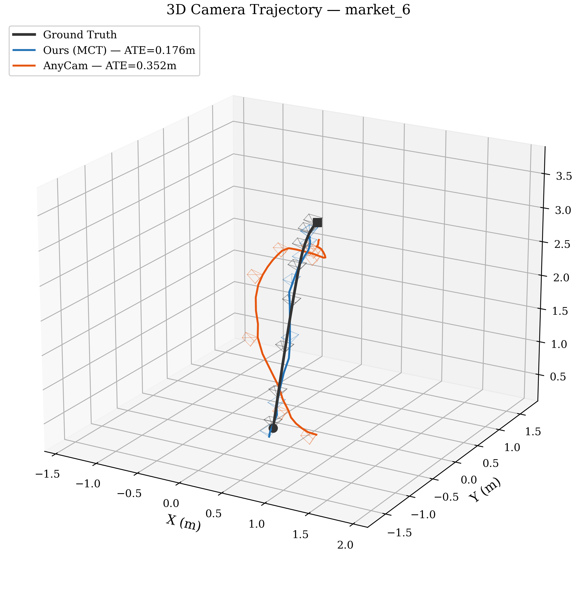

<div align="center">

# Learning Camera Geometry from Unlabeled Real-World Dynamic Video

**Master's Thesis · Technical University of Munich · 2026**

[Kalman Eddi Mahlich](https://github.com/kalman17) &nbsp;·&nbsp; Supervised by Daniil Sinitsyn &nbsp;·&nbsp; Examined by Prof. Dr. Daniel Cremers
*School of Computation, Information and Technology — Informatics*

</div>

<p align="center">
  
  <br>
  <em>The problem: recover camera intrinsics <strong>K</strong> and per-frame poses <strong>(R, t)</strong> from a single casual, uncalibrated video — no calibration target, no ground truth, no offline bundle adjustment. Teaser by <a href="https://github.com/Brummi/anycam">AnyCam (CVPR 2025)</a>, the upstream model this thesis extends.</em>
</p>

---

## TL;DR

This thesis introduces the **Multi-Frame Calibration Transformer (MCT)** — a lightweight, architecture-agnostic module that fuses a pretrained single-image calibration network ([AnyCalib](https://arxiv.org/abs/2503.12701)) with a self-supervised pose estimator ([AnyCam, CVPR 2025](https://arxiv.org/abs/2503.23282)), enforcing multi-frame calibration consistency through cross-frame attention on **intermediate features** rather than on scalar outputs.

Trained fully self-supervised on ~82 k frames of in-the-wild video, the fused system improves on **both** pretrained baselines simultaneously:

|  | Improvement | vs. | Dataset |
|---|---:|---|---|
| **Translation direction error** (median) | **−39.5 %** | AnyCam | MPI Sintel |
| **Calibration MAPE** | **−32.5 %** | AnyCalib (per-frame avg) | TUM-RGBD |
| **Calibration MAPE** | **−87.6 %** | AnyCam (32-candidate system) | TUM-RGBD |
| **Trajectory error (ATE)** | **2.0×** lower | AnyCam | Sintel `market_6` |

Only **~25 M of ~370 M parameters (7.5 %)** are trainable; all pretrained backbones (DINOv2 ViT-L/14, DINOv2 ViT-S/14, UniDepth, UniMatch) remain frozen.

---

## What this repository contains

This is a fork of the [AnyCam (CVPR 2025)](https://github.com/Brummi/anycam) codebase. The upstream AnyCam pipeline is preserved on the [`upstream-anycam`](../../tree/upstream-anycam) branch. Everything on `main` is the thesis contribution.

| Component | What it is | Where |
|---|---|---|
| **Multi-Frame Calibration Transformer (MCT)** | The core contribution — 25 M-param cross-frame attention module operating at the feature level | `experiments/models/` |
| **Calibration ↔ pose coupling** | Wrapper that injects MCT-aggregated focal length into AnyCam's pose head via an 8-dim harmonic focal embedding | `experiments/train_pose_head_anycalib*.py` |
| **Three-phase staged training** | Pose-head warm-start → MCT pre-training → joint self-supervised fine-tuning, unified entry point | `experiments/train_unified.py` |
| **Evaluation suite** | MPI Sintel · TUM-RGBD · KITTI · Objectron benchmarks | `experiments/benchmark_*.py` |
| **Final training artefacts** | Loss histories, training logs, benchmark outputs, figures from the thesis runs | `experiments/final_training_phases/` &nbsp;·&nbsp; `thesis_results/` |
| **Thesis source** | LaTeX project, figures, bibliography | `kalman-tum-thesis-latex-master/` |
| **Defense presentation** | Beamer slides (TUM theme) | `presentation/` |

> **Naming note.** Source code and commits refer to the calibration head as **"DA3"** — that working name was used during development. The final thesis renames it **MCT (Multi-Frame Calibration Transformer)**.

---

## The problem

Recovering camera intrinsics and pose from casual, uncalibrated video is a prerequisite for 3D reconstruction, novel-view synthesis, AR/VR, and autonomous navigation. Strong pretrained models exist for the individual sub-tasks — self-supervised pose, single-image calibration, monocular depth, optical flow — **but they operate in isolation, with no mechanism for joint reasoning or temporal consistency.** AnyCam in particular approximates focal length by selecting among 32 hard-coded candidates at inference, which is both computationally expensive and fundamentally limited in accuracy.

The question this thesis addresses:

> *Can we fuse multiple pretrained models into a unified system that jointly reasons about calibration and pose, while preserving fully self-supervised training?*

---

## How MCT works

The Multi-Frame Calibration Transformer sits **between** AnyCalib's frozen DINOv2 ViT-L/14 backbone and its frozen Light-DPT decoder — a slot that did not exist in either pretrained pipeline before. Pictorially:

```text
   ┌─────────────────────  CALIBRATION  BRANCH  (Ours: MCT inserted)  ─────────────────────┐
                                                                                            
   N frames  ──►  DINOv2 ViT-L/14  ──► [F₁,…,F_N]  ──►  ╔═══════════╗ ──►  Light-DPT  ──►  K
   (h × w × 3)        (frozen)         multi-scale       ║   MCT     ║       (frozen)
                                       per-frame         ║ (~25M, ✱) ║
                                       features          ╚═══════════╝
                                                              ▲
                                                              │
                              cross-frame self-attention + mean-pool over N
   
   ┌──────────────────────  POSE  BRANCH  (Ours: focal embedding added)  ──────────────────┐
                                                                                            
   N frames + depth(UniDepth) + flow(UniMatch) ──► DINOv2 ViT-S/14 (frozen) ──► Pose Neck
                                                                                  (✱)
                                                                                   │
                                                  focal f from K ──► harmonic ────►│
                                                                     embedding     ▼
                                                                                Pose Head ──► (R, t)
                                                                                  (✱)
```

For each spatial position, MCT treats the N frames as a sequence of tokens and applies two layers of multi-head self-attention **across the frame dimension only** (no spatial attention — positions are independent batch items), then mean-pools. The result has the same shape as a single-frame feature map, so the frozen decoder consumes it without modification.

**The key design choice: aggregate at the feature level, not the output level.** Per-frame calibration networks produce noisy intrinsics that *should* be averaged across a video — intrinsics are physically constant within a sequence. But naive scalar averaging of final predictions discards the rich spatial structure in the backbone's intermediate representations. Feature-level aggregation preserves geometric information that scalar averaging would throw away. The numbers bear this out:

> On TUM-RGBD, feature-level aggregation (MCT) cuts calibration MAPE from **11.7 % → 7.9 %** vs. per-frame averaging of the *same* AnyCalib backbone — a 32.5 % relative reduction from a one-line architectural change.

The MCT's output is then fed back into AnyCam's pose head via a learned **focal embedding** (8-dim harmonic encoding), replacing AnyCam's expensive 32-candidate focal-length selection system. The two branches are trained jointly: improved calibration directly benefits pose, and the pose-side flow reprojection loss propagates gradient signal back into the MCT.

---

## How training works

Training is split into **three phases** (thesis §5.3.4). Each phase isolates a subset of trainable components to prevent degenerate solutions during joint optimisation.

| Phase | What trains | Loss | Why |
|---|---|---|---|
| **A** | Pose head only | Flow reprojection + pose consistency | Warm-start the pose head against static (averaged) AnyCalib calibration. Validates that AnyCalib can replace AnyCam's 32-candidate system. |
| **B** | MCT only | Ray reprojection vs. AnyCalib pseudo-GT | Bring MCT's output up to at least per-frame averaging quality before exposing it to joint training. Prevents collapse. |
| **C** | MCT + pose neck + pose head | Flow reprojection + pose consistency + tiny calibration anchor (λ<sub>calib</sub> = 10⁻⁴) | Joint fine-tuning. The small anchor lets MCT improve calibration via the pose signal without drifting from the reasonable AnyCalib prior. |

**Training data:** RealEstate10K · YouTube VOS · WalkingTours · OpenDV (~82 k frames, ~77 k 4-frame training windows).

**Multi-frame consistency at O(N), not O(N²).** Naively, training on N frames requires O(N²) pairwise flow computations. The thesis composes long-range flows from consecutive flows via bilinear warping:

$$\mathbf{w}_{1 \to 3}(u,v) = \mathbf{w}_{2 \to 3}\big((u,v) + \mathbf{w}_{1 \to 2}(u,v)\big)$$

This yields 5 training pairs per 4-frame window (3 consecutive + 2 composed) from O(N) flow computations. Composed pairs are down-weighted (λ<sub>comp</sub> = 0.1) to account for compounding interpolation error. The ablation in Appendix A confirms `max_ahead = 3` is optimal — shorter windows underutilise multi-frame information; longer windows compound flow errors.

---

## Results

All evaluations use **N = 200 sequences (600 pose pairs)** per dataset on raw model outputs — no bundle adjustment, no post-optimisation.

### Pose estimation

| Dataset | Method | Rotation (°) ↓<br>mean / median | Translation Direction (°) ↓<br>mean / median |
|---|---|---:|---:|
| **Sintel** | AnyCam | 0.67 / 0.21 | 89.30 / 86.53 |
| | **Ours (MCT)** | **0.60 / 0.19** | **64.95 / 52.33** |
| | *Δ* | *−10.1 % / −8.2 %* | *−27.3 % / **−39.5 %*** |
| **TUM-RGBD** | AnyCam | 2.03 / 1.23 | 93.04 / 97.05 |
| | **Ours (MCT)** | **1.39 / 0.71** | **71.94 / 66.90** |
| | *Δ* | *−31.7 % / −42.6 %* | *−22.7 % / −31.1 %* |
| **KITTI** | AnyCam | 0.56 / 0.26 | 91.14 / 91.45 |
| | **Ours (MCT)** | **0.54 / 0.25** | **77.20 / 70.93** |
| | *Δ* | *−2.0 % / −2.4 %* | *−15.3 % / −22.4 %* |

### Calibration

| Dataset | Method | f<sub>x</sub> MAE (px) ↓ | f MAPE (%) ↓ |
|---|---|---:|---:|
| **Sintel** | AnyCam (32-cand.) | 502.5 | 68.2 |
| | AnyCalib (per-frame avg) | 329.9 | 30.7 |
| | **Ours (MCT)** | **300.3** | **27.8** |
| **TUM-RGBD** | AnyCam (32-cand.) | 234.1 | 63.7 |
| | AnyCalib (per-frame avg) | 43.0 | 11.7 |
| | **Ours (MCT)** | **30.3** | **7.9** |

KITTI calibration is excluded as a known out-of-distribution failure mode (automotive cameras with long focal lengths and forward-facing motion). Notably, **pose estimation still improves on KITTI despite this** — confirming that multi-frame consistency contributes independently of calibration accuracy. Discussed in thesis §6.4.4.

### Trajectory visualisation

<p align="center">
  
  <br>
  <em>Predicted vs. ground-truth 3D camera trajectory on Sintel <code>market_6</code> after Sim(3) alignment. <strong>Ours (MCT): ATE = 0.176 m. AnyCam: ATE = 0.352 m</strong> — a 2.0× improvement. Across all 23 Sintel sequences, MCT achieves lower ATE on 57 % of them, with the largest gains on sequences featuring substantial camera translation through dynamic scenes.</em>
</p>

---

## Quick start

### Environment

```bash
conda create -n anycam python=3.11 -y && conda activate anycam
pip install torch==2.5.1 torchvision==0.20.1 torchaudio==2.5.1 \
    --index-url https://download.pytorch.org/whl/cu124
conda install -c nvidia cuda-toolkit -y
pip install -r requirements.txt
```

### Inference (upstream AnyCam baseline, for comparison)

```bash
./download_checkpoints.sh anycam_seq8

python anycam/scripts/anycam_demo.py \
    ++input_path=/path/to/video.mp4 \
    ++model_path=pretrained_models/anycam_seq8 \
    ++visualize=true
```

### Training the MCT pipeline (Phases A → B → C)

The unified entry point is `experiments/train_unified.py`. Each phase loads the previous phase's checkpoint and trains the components specified in the table above.

```bash
# Phase A — pose-head warm-start (against static AnyCalib calibration)
python experiments/train_unified.py --phase A \
    --data_dir /path/to/training_data \
    --num_epochs 50 --batch_size 4 --learning_rate 1e-4 \
    --save_dir experiments/final_training_phases/phase_a

# Phase B1 — MCT pre-training against AnyCalib pseudo ground truth
python experiments/train_unified.py --phase B1 \
    --data_dir /path/to/training_data \
    --phase_a_checkpoint experiments/final_training_phases/phase_a/checkpoints/final.pt \
    --num_epochs 50 --batch_size 4 --learning_rate 5e-5 \
    --save_dir experiments/final_training_phases/phase_b1

# Phase C — joint self-supervised fine-tuning (multi-frame, max_ahead=3)
python experiments/train_unified.py --phase C \
    --data_dir /path/to/training_data \
    --phase_b1_checkpoint experiments/final_training_phases/phase_b1/checkpoints/final.pt \
    --num_epochs 50 --batch_size 2 --learning_rate 1e-5 \
    --max_ahead 3 --lambda_calib 1e-4 --lambda_comp 0.1 \
    --save_dir experiments/final_training_phases/phase_c
```

### Benchmarking

```bash
# Pose vs. AnyCam on Sintel / TUM-RGBD / KITTI
python experiments/benchmark_against_anycam.py \
    --da3_stage3_model experiments/final_training_phases/phase_c/checkpoints/final.pt \
    --dataset sintel --num_samples 200 \
    --save_dir experiments/final_training_phases/benchmark_results

# Sweep Phase C checkpoints to pick the best epoch
python experiments/benchmark_phase_c_checkpoints.py \
    --checkpoint_dir experiments/final_training_phases/phase_c/checkpoints \
    --output_dir   experiments/final_training_phases/phase_c/benchmark_results
```

---

## Repository layout

```
anycam-extension/
├── anycam/                          # Upstream AnyCam (CVPR 2025) — unchanged
├── anycalib/                        # AnyCalib submodule
├── unimatch/                        # UniMatch optical-flow fork
├── minipytorch3d/                   # Minimal PyTorch3D variant
├── experiments/                     # ★ Thesis contribution
│   ├── models/                      #   MCT architecture
│   ├── train_unified.py             #   Unified Phase A / B / C entry point
│   ├── train_pose_head_*.py         #   Pose-head experiments + AnyCalib wrapper
│   ├── benchmark_*.py               #   Sintel / TUM-RGBD / KITTI / Objectron
│   └── final_training_phases/      #   Checkpoints, loss histories, benchmark outputs
├── thesis_results/                  # Final reported figures + benchmark tables
├── presentation/                    # Defense slides + figures
├── diagrams/                        # Architecture diagrams (TikZ + PDF)
└── kalman-tum-thesis-latex-master/  # Thesis LaTeX source
```

---

## Citing this work

```bibtex
@mastersthesis{mahlich2026learning,
  title  = {Learning Camera Geometry from Unlabeled Real-World Dynamic Video},
  author = {Mahlich, Kalman Eddi},
  school = {Technical University of Munich},
  year   = {2026},
  type   = {Master's Thesis},
}
```

If you use this code, please also cite the upstream **AnyCam** paper:

```bibtex
@inproceedings{wimbauer2025anycam,
  title     = {AnyCam: Learning to Recover Camera Poses and Intrinsics from Casual Videos},
  author    = {Wimbauer, Felix and Chen, Weirong and Muhle, Dominik and Rupprecht, Christian and Cremers, Daniel},
  booktitle = {Proceedings of the IEEE/CVF Conference on Computer Vision and Pattern Recognition},
  year      = {2025}
}
```

---

## Acknowledgements

This work builds directly on **[AnyCam](https://github.com/Brummi/anycam)** (Wimbauer et al., CVPR 2025) and **[AnyCalib](https://arxiv.org/abs/2503.12701)** (Tirado-Garín et al., 2025), and relies on **UniDepth** (Piccinelli et al.) and **UniMatch** (Xu et al.) as frozen helper networks. Supervision by **Daniil Sinitsyn**; thesis examined by **Prof. Dr. Daniel Cremers** at the Technical University of Munich, Chair of Computer Vision & Artificial Intelligence.
