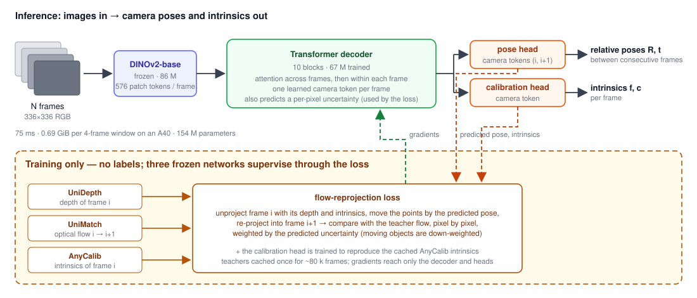

<div align="center">

# MCVO — Multi-frame, Camera-only Visual Odometry

**Camera pose from images alone, trained self-supervised on raw video — no labels, no depth or flow network at test time.**

[Kalman Mahlich](https://github.com/kalman17) · TU Munich, Chair of Computer Vision (Prof. Cremers) · 2026 · weights on [Hugging Face](https://huggingface.co/thekman17/mcvo)

</div>

**MCVO** (*Multi-frame, Camera-only Visual Odometry*) is a transformer that reads a short window of video frames and predicts the relative camera pose between consecutive frames, plus a per-pixel uncertainty map. It sees **images only**. Training needs no ground truth: pretrained depth (UniDepth) and optical-flow (UniMatch) networks and a single-image calibrator (AnyCalib) act as *training-time teachers* through AnyCam's flow-reprojection loss, and are absent at inference. It grew out of a TU Munich master's thesis whose calibration model, MCT, is kept in this repository as the calibration branch (second half of this page).

---

## Where it sits: accuracy · cost · supervision, one table

Rows are metrics, columns are methods. The first six columns are **measured here** under one protocol: one process per model on the same NVIDIA A40, identical 4-frame windows (30 per dataset for cost, 16 per sequence for accuracy), CUDA-synchronised, warm-up excluded, end-to-end per call (images in → poses/intrinsics out, including each model's own preprocessing and, for AnyCam, its depth and flow networks). The last four columns are **as reported by their authors** on other hardware and protocols — listed so the picture is complete, and queued to be measured on this protocol. Raw: [`honest_benchmarks/latency_summary.json`](honest_benchmarks/latency_summary.json), `experiments/bench_latency.py`, `honest_benchmarks/{e3_final_square336,thesis_final_e4_square336,e0_*,kfix_*}`.

| | **MCVO (ours)** | π³ | VGGT-1B | Depth Anything 3 | AnyCam (CVPR'25) | MCT + AnyCam (thesis) | DPVO* | FVO / VoT* | Monodepth2-style pose net* | ORB-SLAM3* |
|---|---|---|---|---|---|---|---|---|---|---|
| Measured here | ✔ | ✔ | ✔ | ✔ | ✔ | ✔ | reported | reported | reported | reported |
| Labels for training | **none** | GT poses/depth | GT | GT | none | none | GT poses (TartanAir) | GT poses | none (photometric) | none (classical) |
| Inputs at test time | images | images | images | images | images (+ runs depth & flow nets) | images (+ depth & flow nets) | images + **intrinsics** | images | image pairs | images + **intrinsics** |
| Parameters | **154 M** (67 M trained) | 959 M | 1257 M | 1690 M | 115 M + teachers | 460 M (25 M trained) | small | ~500 M | ~15 M | — |
| Weights on disk | **0.57 GiB** | 3.57 GiB | 4.68 GiB | 6.30 GiB | 0.43 GiB | 1.71 GiB | — | — | ~0.06 GiB | — |
| Peak GPU memory, 4-frame window | **0.69 GiB** | 5.5 GiB | 7.0 GiB | 9.7 GiB | 3.7 GiB | 5.0 GiB | ~4.9 GB (3090, streaming) | not published | small | CPU |
| Latency, 4-frame window (A40) | **75 ms** | 171 ms | 203 ms | 600 ms | 413 ms | 820 ms | ~60 fps @512×384 (3090); 120 fps variant | "~2× DPVO", "10× 3D foundation models" (3090) | milliseconds / pair | real-time, CPU |
| Latency, 8-frame window | **132 ms** | 300 ms | 376 ms | 1180 ms | 877 ms | 1645 ms | — | — | — | — |
| Rotation error, median — Sintel / TUM / KITTI | 0.46° / 0.89° / 0.19° | 0.22° / 0.26° / 0.11° | 0.28° / 0.32° / 0.12° | 0.19° / 0.27° / 0.09° | 0.50° / 0.74° / 0.20° | 0.40° / 0.67° / 0.23° | — | — | — | — |
| Heading error, KITTI (zero-shot for ours) | 7.0° | 2.2° | 4.6° | 1.3° | 28.6° | 28.2° | — | — | — | — |
| Heading error — Sintel / TUM | 81° / 90° | 27° / 34° | 38° / 37° | 19° / 32° | 49° / 50° | 47° / 65° | — | — | — | — |
| Focal error — Sintel / TUM / KITTI | — (pose only) | 25.2 % / 7.6 % / 28.9 % | 34.0 % / 25.8 % / 37.1 % | 24.4 % / 4.6 % / 15.8 % | 70.3 % / 14.6 % / 66.9 % | 20.7 % / 12.9 % / 20.4 % | needs intrinsics | — | — | needs intrinsics |
| Trajectory (Sintel ATE, Sim3) | 0.18 | — | — | — | 0.10 | 0.18 | strong (BA inside) | strong | weak | strong |
| Source | this repo | [paper](https://arxiv.org/abs/2507.13347) | [paper](https://arxiv.org/abs/2503.11651) | [paper](https://arxiv.org/abs/2511.10647) | [paper](https://arxiv.org/abs/2503.23282) | this repo | [Teed 2023](https://proceedings.neurips.cc/paper_files/paper/2023/file/7ac484b0f1a1719ad5be9aa8c8455fbb-Paper-Conference.pdf) | [Yugay 2025](https://arxiv.org/abs/2510.03348) | [Godard 2019](https://arxiv.org/abs/1806.01260) | [Campos 2021](https://arxiv.org/abs/2007.11898) |

*\* as reported by the authors, not measured here; different GPUs, resolutions and protocols.*

How to read it: MCVO runs at 5–14× lower peak memory and 2–8× lower latency than the billion-parameter supervised models and 5–11× below the two self-supervised pipelines, with no labels at any stage — at roughly twice their rotation error, competitive heading on driving video, and near-chance heading on small-baseline indoor video (a limitation that did not respond to longer context, teacher distillation, an epipolar loss, or motion-rich extra data). It is not the cheapest VO in existence: patch-based SLAM systems with bundle adjustment (DPVO) and tiny photometric pose nets are cheaper per frame, and classical SLAM runs on a CPU — those need known intrinsics, ground-truth poses for training, or give up much accuracy. Among image-only, feed-forward multi-frame transformers that reach VGGT-class rotation accuracy, MCVO is the smallest, the cheapest measured, and the only one trained without labels. If intrinsics are needed, pair it with the calibration branch below (MCT: 161 ms / 1.4 GiB, specialist-level focal accuracy) — a calibration head inside MCVO is in progress.

## How MCVO works

<p align="center"></p>

- **Backbone:** frozen DINOv2-base (86 M) → patch tokens per frame.
- **Decoder:** 10 blocks, each = temporal attention (every patch position attends across the frames of the window) → spatial attention within each frame including a learned per-frame **camera token** → MLP. 67 M trained parameters.
- **Heads:** the camera tokens of adjacent frames are concatenated and regressed to a relative pose (quaternion + translation); patch tokens give a per-pixel uncertainty map that lets the loss discount moving objects and unreliable regions.
- **Loss (self-supervised):** unproject the teacher depth of frame *i*, move it by the predicted pose, re-project into frame *i+1*, compare with the teacher optical flow under a Laplacian likelihood weighted by the predicted uncertainty. Intrinsics for the unprojection come from the cached AnyCalib per-frame estimates. All three teachers are consulted only inside the loss.
- **Data:** ~80 k frames of unlabeled video (RealEstate10K, YouTube-VOS, EpicKitchens, WalkingTours) preprocessed once with the AnyCam pipeline; 8-frame clips; 6 epochs on one GPU.
- **Code:** [`mcvo/`](mcvo/) (`model.py`, `loss.py`, `train.py`), evaluated with [`experiments/honest_benchmark.py`](experiments/honest_benchmark.py) (`--models mcvo:<ckpt>`); cost benchmark [`experiments/bench_latency.py`](experiments/bench_latency.py).

```bash
# train
PYTHONPATH=. python mcvo/train.py --data_dir /path/to/preprocessed --save_dir runs/mcvo \
    --backbone facebook/dinov2-base --d_model 640 --depth 10 --heads 8 --max_ahead 7 \
    --batch_size 4 --lr 1.5e-4 --epochs 6
# evaluate on the honest window protocol
PYTHONPATH=. python experiments/honest_benchmark.py --run_name mcvo_eval \
    --datasets sintel,tumrgbd,kitti --models mcvo:runs/mcvo/checkpoints/epoch_0006.pt
```

**Known limitations, stated plainly.** Translation direction on small-baseline indoor video is near chance; four interventions (longer context, teacher distillation, an epipolar/Sampson loss, motion-rich extra data) did not move it and it is treated as structural to flow-reprojection self-supervision when parallax is tiny. Trajectory-level accuracy trails AnyCam's long-context inference (0.18 vs 0.10 Sintel ATE) because short-window errors accumulate. No intrinsics head yet. History of every number on this page, including corrections: [CHANGELOG.md](CHANGELOG.md).

---

## The calibration branch: MCT

MCVO predicts pose only. If you need intrinsics, this repository also contains **MCT** (Multi-Frame Calibration Transformer), a 25 M-parameter module that fuses [AnyCalib](https://arxiv.org/abs/2503.12701)'s intermediate features across the frames of a video into one calibration and plugs into the AnyCam pose pipeline — specialist-level focal accuracy at 161 ms / 1.4 GiB per 4-frame window. It comes from the TU Munich master's thesis this project grew out of; the full write-up, results, training phases and reproduction commands are in [`docs/thesis.md`](docs/thesis.md), weights at [`thekman17/anycam-mct`](https://huggingface.co/thekman17/anycam-mct).

## Repository layout

```
mcvo/                        # ★ MCVO: model.py, loss.py, train.py (image-only VO)
experiments/
├── honest_benchmark.py      # window-protocol benchmark harness (all methods, incl. VGGT / π³ / DA3)
├── bench_latency.py         # controlled latency / memory benchmark
├── calib_bench/             # loaders + motion-observability labels used by the harness
├── models/                  # MCT (calibration branch)
└── train_unified.py, ...    # MCT training phases (see docs/thesis.md)
honest_benchmarks/           # raw per-window rows behind every number on this page
docs/thesis.md               # the master's thesis material (MCT), in full
anycam/ anycalib/ unimatch/  # upstream AnyCam (CVPR 2025), AnyCalib, UniMatch — unchanged
CHANGELOG.md                 # every published number and its corrections, dated
```

---

## Citing this work

For MCVO (the model above) there is no paper yet; cite the repository:

```bibtex
@misc{mahlich2026mcvo,
  title  = {MCVO: Multi-frame, Camera-only Visual Odometry, self-supervised from raw video},
  author = {Mahlich, Kalman},
  year   = {2026},
  howpublished = {\url{https://github.com/kalman17/mcvo}},
}
```

For the calibration branch (MCT), the thesis:

```bibtex
@mastersthesis{mahlich2026learning,
  title  = {Learning Camera Geometry from Unlabeled Real-World Dynamic Video},
  author = {Mahlich, Kalman Eddi},
  school = {Technical University of Munich},
  year   = {2026},
  type   = {Master's Thesis},
}
```

If you use this code, please also cite the upstream **AnyCam** paper:

```bibtex
@inproceedings{wimbauer2025anycam,
  title     = {AnyCam: Learning to Recover Camera Poses and Intrinsics from Casual Videos},
  author    = {Wimbauer, Felix and Chen, Weirong and Muhle, Dominik and Rupprecht, Christian and Cremers, Daniel},
  booktitle = {Proceedings of the IEEE/CVF Conference on Computer Vision and Pattern Recognition},
  year      = {2025}
}
```

---

## Acknowledgements

This work builds directly on **[AnyCam](https://github.com/Brummi/anycam)** (Wimbauer et al., CVPR 2025) and **[AnyCalib](https://arxiv.org/abs/2503.12701)** (Tirado-Garín et al., 2025), and relies on **UniDepth** (Piccinelli et al.) and **UniMatch** (Xu et al.) as frozen helper networks. Supervision by **Daniil Sinitsyn**; thesis examined by **Prof. Dr. Daniel Cremers** at the Technical University of Munich, Chair of Computer Vision & Artificial Intelligence.
